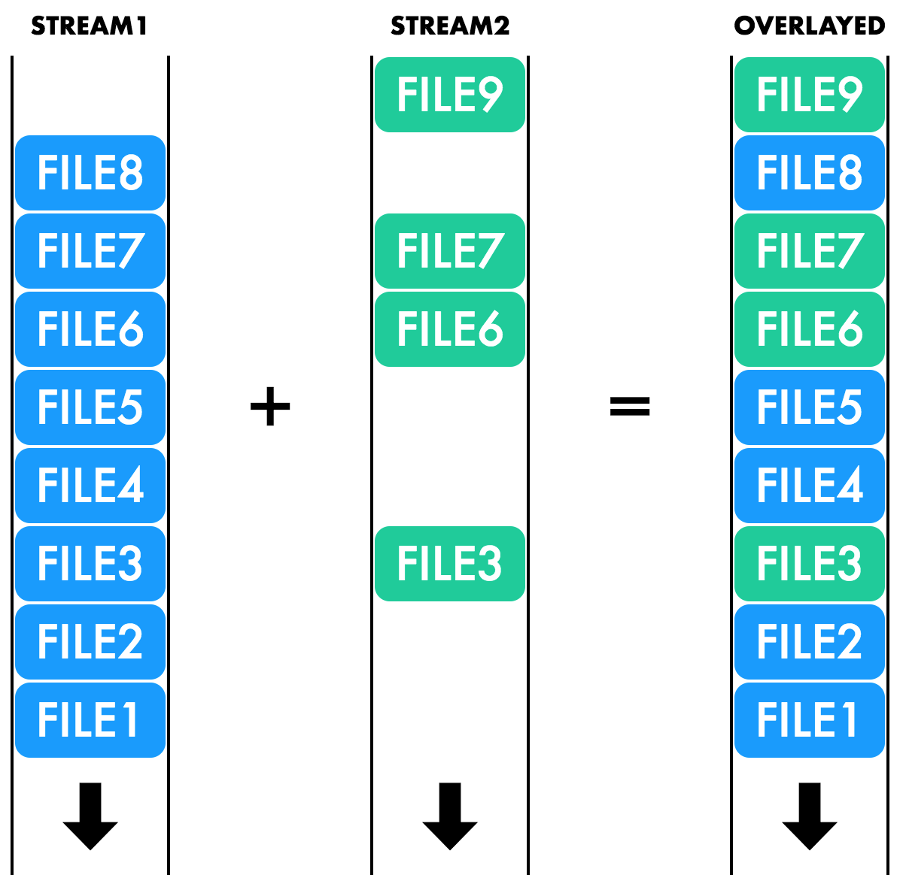

[](https://www.npmjs.com/package/gulp-overlay)
[](https://travis-ci.org/svenschoenung/gulp-overlay)
[](https://coveralls.io/github/svenschoenung/gulp-overlay?branch=master)
[](https://david-dm.org/svenschoenung/gulp-overlay)
[](https://david-dm.org/svenschoenung/gulp-overlay#info=devDependencies)
[](https://codeclimate.com/github/svenschoenung/gulp-overlay)
[](https://www.codacy.com/app/svenschoenung/gulp-overlay)

# gulp-overlay

Merge two gulp streams by overlaying one onto the other.



## Installation

    npm install --save-dev gulp-overlay

## Usage

Assume the following folder structure:

    src/
      common/
        menu.html
        main.html
        footer.html
        pages/
          about.html
      project1/
        menu.html
        main.html
        pages/
          about.html
          tos.html
      project2/
        main.html
        footer.html
        pages/
          legal.html

You can use `overlay.with()` to overlay `project1/` on top of `common/`. Files in `project1/` will overwrite the corresponding files in `common/`.

```javascript
var overlay = require('gulp-overlay');

gulp.task('build-project1', function() {
  return gulp.src('src/common/**/*.html')
    .pipe(overlay.with(gulp.src('src/project1/**/*.html')))
    .pipe(gulp.dest('dist/project1'));
});

gulp.task('build-project2', function() {
  return gulp.src('src/common/**/*.html')
    .pipe(overlay.with(gulp.src('src/project2/**/*.html')))
    .pipe(gulp.dest('dist/project2'));
});
```

Alternatively you can use `overlay.onto()` to do the same thing:

```javascript
var overlay = require('gulp-overlay');

gulp.task('build-project1', function() {
  return gulp.src('src/project1/**/*.html')
    .pipe(overlay.onto(gulp.src('src/common/**/*.html')))
    .pipe(gulp.dest('dist/project1'));
});

gulp.task('build-project2', function() {
  return gulp.src('src/project2/**/*.html')
    .pipe(overlay.onto(gulp.src('src/common/**/*.html')))
    .pipe(gulp.dest('dist/project2'));
});
```
The result in both cases is the following:

    dist/
      project1/
        menu.html     1
        main.html     1
        footer.html   *
        pages/
          about.html  1
          tos.html    1
      project2/
        menu.html     *
        main.html     2
        footer.html   2
        pages/
          about.html  *
          legal.html  2
          
          
`*`: files from the `src/common/` directory  
`1`: files from the `src/project1/` directory  
`2`: files from the `src/project2/` directory

### Minimizing memory utilization

`gulp-overlay` doesn't need file contents to do its job. That means you can defer reading them by providing the `read:false` option to `gulp.src()`. After `gulp-overlay` is finished you can read the file contents using [`gulp-read`](http://github.com/svenschoenung/gulp-read):

    var overlay = require('gulp-overlay');
    var read = require('gulp-read');
  
    gulp.task('build-project1', function() {
      return gulp.src('src/project1/**/*.html', {read:false})
        .pipe(overlay.onto(gulp.src('src/common/**/*.html', {read:false})))
        .pipe(read())
        .pipe(gulp.dest('dist/project1'));
    });

## License

[MIT](LICENSE)
